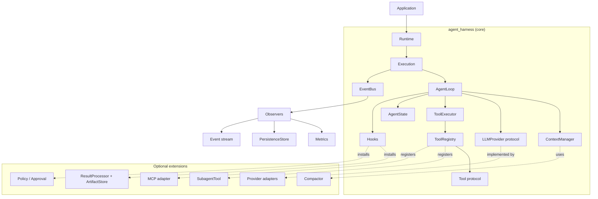
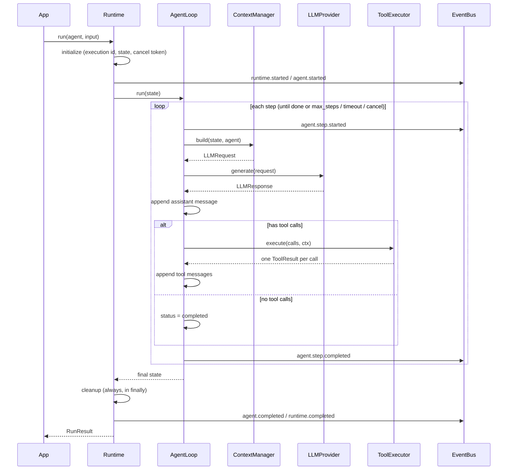

# Architecture: Generic Python Agent Harness

Status: Phase 0 proposal, pending review.

- Rationale for each choice: [framework-reference-map.md](framework-reference-map.md).
- Interface details: [design.md](design.md).

## 1. Goals and non-goals

**Goals:**
- A small, Python-native core.
- Replaceable components behind protocols.
- An explicit lifecycle.
- Reliable termination.
- Every extension added through hook points, never by editing the loop.

**Non-goals:**
- Application logic of any kind (RCA, coding, research).
- A DI container or plugin hot reload.
- Distributed execution and a server.
- UI.
- Provider SDKs in the core.

## 2. Layered view



**Dependency rule:** arrows point inward. The core imports nothing from `extensions/` or `providers/`. Extensions depend only on core protocols. This is DeepSeek's "depend on service definitions, never providers" rule, enforced by package layout and an import-lint test.

## 3. Components

| Component | Responsibility | Replaceable via |
|---|---|---|
| `Agent` | Declarative definition: id, name, instructions, tools, model settings, limits. It has no runtime state. | Plain value object |
| `Runtime` | Owns an execution's lifecycle: initialize → prepare → loop → complete → cleanup. Also enforces the overall timeout and cancellation, emits runtime events, and returns `RunResult`. | Constructor injection of providers and collaborators |
| `Execution` | Live handle for one run: the execution id, state, cancel token, event bus, and `cancel()`. | Internal |
| `AgentLoop` | The step loop, and nothing else: build context → call LLM → execute tools → update state → decide whether to continue. | `LoopStrategy` protocol (Phase 16), as with DeepSeek's replaceable agent-loop |
| `AgentState` | Serializable execution state: messages, step, status, usage, result, metadata, and an extension KV store. | Pydantic model |
| `ContextManager` | Turns `AgentState` + `Agent` + tool schemas into an `LLMRequest`. It owns token budgeting and calls the `Compactor`. | `ContextManager` protocol |
| `LLMProvider` | `generate(request) → LLMResponse`, plus `stream(request)` in Phase 8. | Protocol; adapters live outside the core |
| `Tool` / `ToolRegistry` | Tool contract; registration, lookup and schema export. | Protocol / class |
| `ToolExecutor` | Runs a batch of tool calls and always returns exactly one result per call. | Protocol: sequential in Phase 1, pipeline in Phase 4, parallel in Phase 12 |
| `Hooks` | Named interception points with explicit semantics (see §5). | Registered callables |
| `EventBus` / `Observer` | Immutable events fanned out to observers. Observation only; observers can never change behavior. | Protocols |
| `PersistenceStore` | Optional checkpoint and event storage. | Protocol |

## 4. Lifecycle



**Terminal statuses:**

| Status | Meaning |
|---|---|
| `completed` | The model produced a final answer with no tool calls. |
| `max_steps` | The step limit was reached. |
| `timed_out` | The overall execution timeout expired. |
| `cancelled` | The run was cancelled. |
| `failed` | An unrecoverable error occurred. |
| `awaiting_input` | Reserved for Phase 14 suspend/resume. |

Output truncation (`finish_reason=length`): the loop asks the model to continue, up to 3 times. If the output is still truncated, the run ends as `failed` with `OUTPUT_TRUNCATED`, and the partial text is kept. See [design.md §8a](design.md).

## 5. Extension model: observation vs interception

Both repositories teach the same lesson: keep **observing** and **changing** behavior separate.

- **Events → Observers (observation).**
  - Events are fire-and-forget, immutable, and delivered after the fact.
  - A failing observer is logged and isolated.
  - Metrics, persistence, streaming and logging all live here.
- **Hooks (interception).** There is a small, fixed set of named points, each with one typed return contract. They are modeled on DeepSeek's waterfalls, reduced to the points that proved necessary in both repositories:

| Hook | Called | May |
|---|---|---|
| `before_step` | Before context build | Inject messages; stop the run |
| `transform_request` | After context build, before the LLM | Return a modified `LLMRequest` (ephemeral, not persisted; TF `preLLMEphemeral`) |
| `wrap_llm` | Around `provider.generate` | Middleware: retry, timeout, caching |
| `before_tool` | Per call, before execution | `allow` / `deny(reason)` / `ask` |
| `wrap_tool` | Around the tool body | Middleware: timeout, metrics |
| `after_tool` | Per result | Replace content (large-result handling), attach context |
| `before_stop` | When the loop would complete | Request continuation with a message (bounded by `max_steps`) |

- **Plugin (Phase 16)** is a bundle of hooks, tools, observers and prompt sections, installed with `setup()` and removed with `teardown()`. This is the TrueForge `AgentCapability` shape.

The core loop calls hook *points*. With no hooks registered, each point is a no-op, so Phase 1 runs without any extension machinery.

## 6. Where each future capability plugs in

| Capability | Mechanism | Loop changes |
|---|---|---|
| Retry | `wrap_llm` middleware (default `RetryPolicy`) | none |
| Timeouts | `wrap_llm` / `wrap_tool` + runtime deadline | none |
| Repeated-call detection | `after_tool` + `before_step` policy | none |
| Context budget / compaction | Inside `ContextManager` → `Compactor` | none |
| Tool pipeline | `ToolExecutor` implementation + tool hooks | none |
| Large results | `after_tool` → `ResultProcessor` → `ArtifactStore` | none |
| Events / observability | `EventBus` emits from runtime, loop and executor | emit calls only |
| Streaming | `runtime.stream()` = observer → `asyncio.Queue`; tokens via `provider.stream` | the LLM call switches to stream when requested |
| Persistence | Observer + checkpoint at `agent.step.completed` | none |
| Subagents | `SubagentTool` → `runtime.run(child)` | none |
| Parallel tools | `ParallelToolExecutor` | none |
| MCP | `MCPToolSource` → registers `Tool`s | none |
| Approval / policy | `before_tool` → `ApprovalHandler` | none |
| Replay | Rebuild state from persisted events / checkpoints | none |

## 7. Proposed package layout

```text
harness-agent/
├── pyproject.toml
├── src/agent_harness/
│   ├── __init__.py          # public API re-exports
│   ├── messages.py          # Message, parts, ToolCall
│   ├── state.py             # AgentState, RunStatus
│   ├── agent.py             # Agent, AgentLimits
│   ├── llm.py               # LLMProvider, LLMRequest, LLMResponse, Usage, FinishReason
│   ├── tools.py             # Tool, FunctionTool, @tool, ToolContext, ToolResult
│   ├── registry.py          # ToolRegistry
│   ├── executor.py          # ToolExecutor protocol + SequentialToolExecutor
│   ├── context.py           # ContextManager protocol + DefaultContextManager (minimal in Phase 1)
│   ├── loop.py              # AgentLoop
│   ├── runtime.py           # Runtime, Execution, RunResult
│   ├── errors.py            # HarnessError hierarchy
│   ├── events.py            # (Phase 5)
│   ├── hooks.py             # (Phase 4)
│   └── testing/             # ScriptedProvider, mock tools — shipped for users' tests
├── src/agent_harness_ext/   # later phases: compaction, results, subagents, mcp, persistence, otel
├── examples/
├── tests/{unit,integration}/
└── docs/
```

## 8. Dependencies

| Dependency | Scope | Notes |
|---|---|---|
| Python ≥ 3.11 | Core | Needed for `asyncio.TaskGroup`, `asyncio.timeout` and `ExceptionGroup` |
| `pydantic>=2` | Core | The only runtime dependency |
| `pytest`, `pytest-asyncio` | Development only | |
| `mcp` | Optional extra | |
| `opentelemetry-api` | Optional extra | |
| Provider SDKs | Optional extras, in adapter modules only | |
